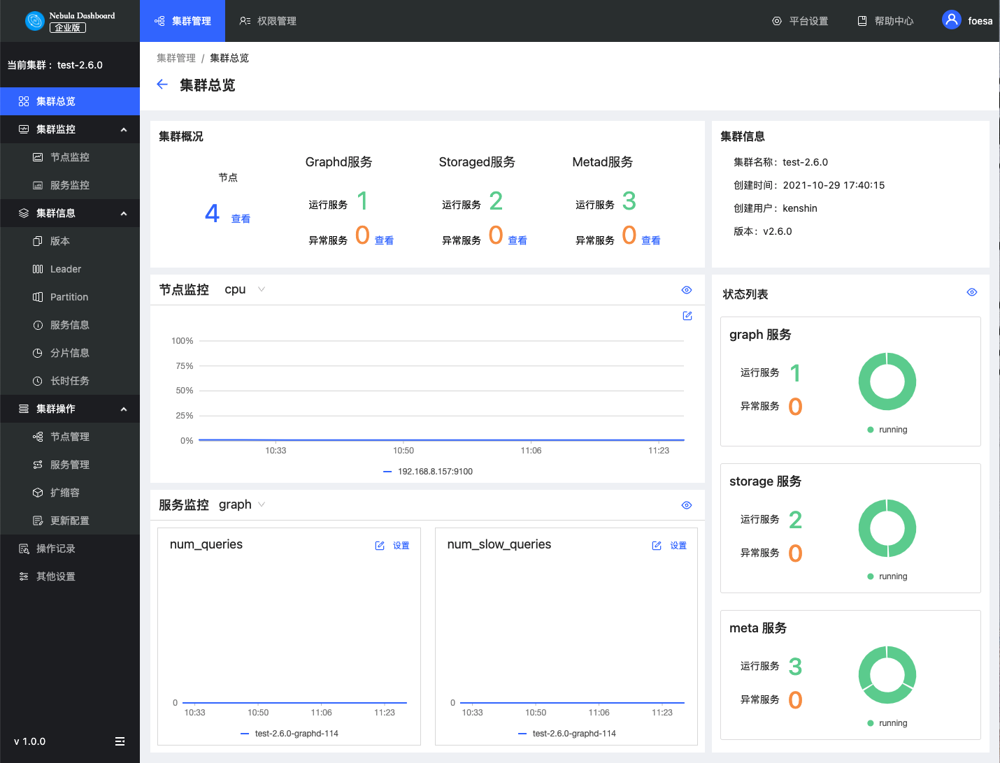

# 集群总览

本文主要介绍Dashboard的集群总览页面。在集群列表右侧，单击**详情**，即可进入指定集群的集群总览页面。

## 概览

Dashboard 的集群总览页面分为五个部分：

- 集群概况
- 集群信息
- 节点监控
- 状态列表
- 服务监控

### 集群概况

在集群概况中，显示了节点数量，Graphd、Storaged、Metad正在运行服务及异常服务数量。在本示例中，Storaged存在异常服务为 **1**，可以点击 **查看** 按钮，快速查看异常服务。

### 集群信息

在集群信息中，显示了 **集群名称**、**创建时间**、**创建用户**、**版本** 的信息。

!!! note

    这里的版本信息为用户安装的Nebula Graph版本，而非Dashboard版本。

!!! caution

    如果用户导入的Nebula Graph版本低于2.5或版本未知的情况下，默认显示为v2.0.1。

### 节点监控

支持快速查看节点监控信息，如cpu、memory等信息，支持在页面上点击插入基准线。并且用户也可以点击快速跳转至节点监控页面，查看详情信息。

### 状态列表

用饼图的方式形象的展示节点运行服务状态。

### 服务监控

默认显示`query_latency_us`（查询平均延迟）和`slow_query_latency_us`（慢查询平均延迟）的信息，支持在页面上点击设置插入基准线。并且用户也可以点击快速跳转至服务监控页面，查看详情信息。