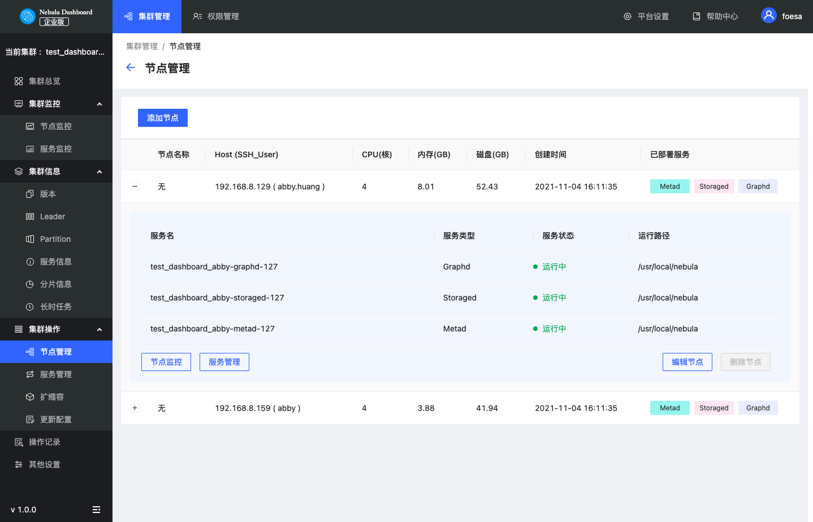

# 集群操作

本文主要介绍 Dashboard 的集群操作，主要为以下四个部分：
- 节点管理
- 服务管理
- 扩缩容
- 更新配置

## 节点管理

在节点管理页面中，展示所有的节点详情信息，包括节点名称、Host及SSH用户名称、CPU核等信息。

- 点击 **添加节点** 输入Host信息、SSH端口号、用户、密码信息，选择Nebula Graph安装包，可快速添加节点。

- 点击  按钮，查看对应节点服务名、服务类型、服务状态、运行路径等信息。

  - 点击 **节点监控** 可快速跳转至节点监控页面，详情信息见 [集群监控](../4.cluster-operator/2.monitor.md)。

  - 点击 **编辑节点** 可修改SSH端口号、用户名、密码。
  
  - 当节点上无服务时，可点击 **删除节点**。

## 服务管理

在服务管理页面，用户可以选择服务类型、服务状态、Host对展示的数据进行筛选，快速选中一个或多个服务，一键启动/停止/重启服务。

!!! danger

    单击**停止**/**重启**，会立即中断进行中的任务，可能会导致数据不一致，请在业务低峰期执行该操作。

点击 图标，可快速查看 [服务监控](../4.cluster-operator/2.monitor.md)。

## 扩缩容

在扩缩容页面，用户可以快速**添加节点**、**批量导入节点**，并对已存在的节点添加 **Graph服务** 及 **Storage服务**。点击 **重置** 按钮，可以恢复到初始状态。

!!! caution

    目前仅支持对graphd和storaged进行扩缩容，不支持移除或添加metad服务。

在该示例中，新增了节点为`192.168.8.169`，`192.168.8.143`和`192.168.8.144`的 Graph 服务，删除了节点为`192.168.8.144`的Storage服务。虚线框并置灰服务名表示移除的服务，实线框表示添加的服务。

在下方的**服务**中，绿色表示即将新增的服务，红色表示即将移除的服务。可以修改新增服务的端口号、HTTP端口号、HTTP2端口号信息。

!!! caution

     扩缩容集群时，建议提前备份数据，以便故障发生时回滚数据。关于扩缩容，详情参见[如何扩缩容](../../20.appendix/0.FAQ.md#_11)。

## 更新配置

更新配置页面可以修改Storage及Graph服务的配置文件，具体参数及描述见 [Storage服务配置](../../5.configurations-and-logs/1.configurations/4.storage-config.md) 和 [Graph服务配置](../../5.configurations-and-logs/1.configurations/3.graph-config.md)。更新配置文件为批量操作，将会修改每一个Storage/Graph的配置文件。

- 点击保存后，在下一次服务重启后配置即生效。

- 点击 **保存并重启** 可直接重启服务使配置立即生效。

  !!! danger

        单击**保存并重启**，会立即中断进行中的任务重启集群，可能会导致数据不一致，请在业务低峰期执行该操作。