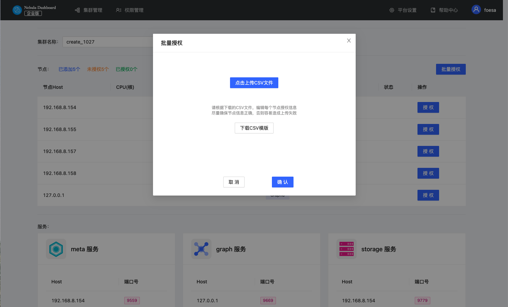

# 导入集群

本文介绍如何通过Dashboard导入集群。当前版本仅支持官方下载的DEB、RPM包部署的集群和Dashboard创建的集群导入，暂不支持导入使用Docker和Kubernetes方式部署的集群。

## 操作步骤

!!! caution

    - 在同一集群下，服务需要统一版本。不支持在同一集群中导入不同版本的Nebula Graph实例。
    - Nebula Graph的安装路径需要为默认安装路径`/usr/local`。

1. 在集群管理页面，点击 **导入集群** 标签。
2. 在导入集群页面，输入连接Nebula Graph的信息：
  - Graphd Host：<其中一个Graphd进程的虚机IP>:<端口号>。本示例设置为 `192.168.8.157:9669`。
  - 用户名：连接Nebula Graph的账号，本示例设置为`vesoft`。
  - 密码：连接Nebula Graph的密码，本示例设置为`nebula`。

  !!! note

        因为 Nebula Graph 默认不启用身份验证，所以，一般情况下用户可以使用 `root` 账号和任意密码连接 Nebula。
        当 Nebula Graph 启用了身份验证后，用户只能使用指定的账号和密码连接 Nebula。关于 Nebula Graph 的身份验证功能，参考 [Nebula Graph 用户手册](../../7.data-security/1.authentication/1.authentication.md "点击前往 Nebula Graph 官网")。
   
   

3. 在连接服务节点页面完成以下配置：
   - 输入集群的名称，最大可输入15个字符，本示例设置为`create_1027`。
   - 对节点进行 **授权**，授权需输入每个节点的 SSH 用户名及密码。
   - **批量授权**需要上传CSV文件。请根据下载的CSV文件，编辑每个节点授权信息，尽量确保节点信息正确，否则容易造成上传失败。
   
   - 页面中节点状态变为 **已授权**，则该节点授权成功。
   

4. 确保所有节点都授权成功，点击 **导入集群**。

## 后续操作

成功导入集群后，用户可以对集群进行操作，详情见[总览](../4.cluster-operator/1.overview.md)。
