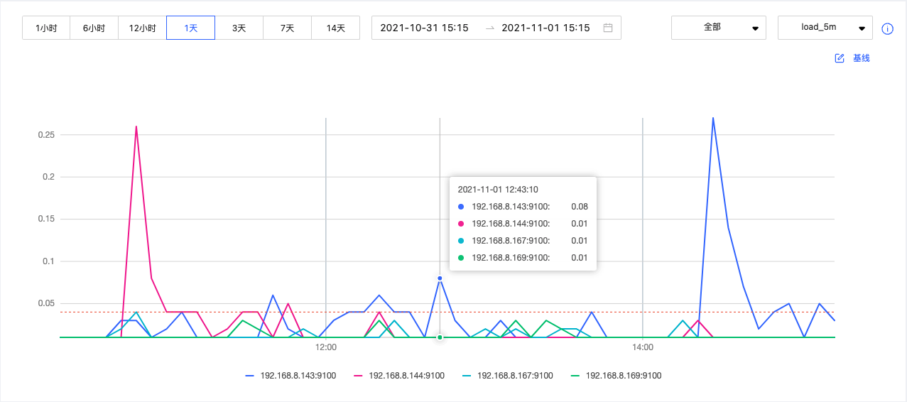

# 集群监控

本文主要介绍 Dashboard 的集群监控中的节点监控、服务监控、图空间监控，以及可视化的监控大屏。

## 节点监控

在 Dashboard 顶部导航栏，单击**集群管理**，然后单击**集群监控**->**节点监控**进入节点监控页面。

用户可快速查看 CPU、Memory、Load、Disk 和 Network In/Out 变化情况。

- 如果需要设置基线，作为参考标准线，可以单击模块右上角的 按钮。
- 如果需要查看某一项更详细的监控指标，可以单击模块右上角的 按钮，在示例中选择`Load`查看详情信息，如下图。
    
  - 默认最多可选择 14 天的监控数据进行查看，也可以快捷选择 1 小时、6 小时、12 小时、1 天、3 天、7 天和 14 天，支持修改查看时间。
  - 可以选择需要查看的机器和监控指标。监控指标详情请参见[监控指标说明](../7.monitor-parameter.md)。
  - 可以设置基线，作为参考标准线。

## 服务监控

在 Dashboard 顶部导航栏，单击**集群管理**，然后单击**集群监控**->**服务监控**进入服务监控页面。

用户可快速查看 Graph、Meta、Storage 服务的信息，右上角显示正常服务和异常服务的数量。

!!! note

    当前企业版的服务监控页仅支持每种服务设置两个监控指标，可以单击模块内的设置按钮进行调整。

- 如果需要查看某一项更详细的监控指标，可以单击模块右上角的 按钮，在示例中选择 `Graph` 查看详情信息，如下图。
   
  - 默认最多可选择 14 天的监控数据进行查看，也可以快捷选择 1 小时、6 小时、12 小时、1 天、3 天、7 天和 14 天，支持修改查看时间。
  - 可以选择需要查看的机器和监控指标。监控指标详情请参见[监控指标说明](../7.monitor-parameter.md)。
  - Graph 服务支持一系列基于图空间的监控指标。详情参见下文**图空间监控**。
  - 可以设置基线，作为参考标准线。
  - 可以查看当前服务的状态。

## 图空间监控

!!! note

    使用图空间指标前，用户需要在 Graph 服务中，设置`enable_space_level_metrics`为`true`。具体操作，参见[更新配置](4.manage.md)。

图空间的监控指标记录不同图空间的数据。目前，只有 Graph 服务支持基于图空间的监控指标。

只有当图空间指标的行为被触发后，用户才能指定图空间查看对应的图空间指标的信息。Dashboard 支持的图空间指标，参见[图空间](../7.monitor-parameter.md)。

## 可视化监控大屏

Dashboard 企业版的可视化监控大屏帮助用户一目了然地把握集群的健康状态、服务及节点信息。

在 Dashboard 顶部导航栏，单击**集群管理**，然后单击**集群监控**->**监控大屏**进入监控大屏页面。
    
<!-- 增加大屏图片 -->

| 大屏区域         | 显示信息                                                     |
| ------------ | ------------------------------------------------------------ |
| 中间区域上方 | 1. 集群的健康度，为集群的健康打分。关于打分规则，参见下文 Note 说明。  2. 运行的节点信息和数量、集群中运行中的服务个数和异常服务的个数。  3. 当前时间的节点 CPU 和内存使用率。 4. 告警信息。系统按照告警消息的严重级别（emergency>critical>warning）展示最近触发的 5 条告警消息。更多信息，参见[监控告警](../9.alerts.md)。 |
| 中间区域下方 | 在不同时间段 4 个 Graph 服务指标的监控信息。4 个指标分别是： 1. num_active_sessions 2. num_slow_queries 3. num_active_queries 4. num_query_errors |
| 左侧区域     | 1. 集群的每秒查询率 QPS (Query Per Second)。 2. 在不同时间段两个 Storage 服务指标的监控信息。两个指标分别是 add_edges_latency_us、add_vertices_latency_us。 |
| 右侧区域     | 在不同时间段节点相关指标的信息，指标包括： 1. cpu_utilization 2. memory_utilization 3. load_1m 4. disk_readbytes 5. disk_writebytes |

有关监控指标的具体信息，参见[指标监控](../7.monitor-parameter.md)。

!!! note

    集群的健康打分规则如下：

    - 最高 100 分，最低 13 分。
    - 当 100≥健康度≥80，分数为蓝色；当 80＞健康度≥60，分数为黄色；当健康度＜60，分数为红色。
    - 算法：(1-异常服务数/总服务数)*100%。
    - 除第一个出现的`emergency`级别的告警扣 40 分外，其余`emergency`级别及其他级别的告警每个扣 10 分。
