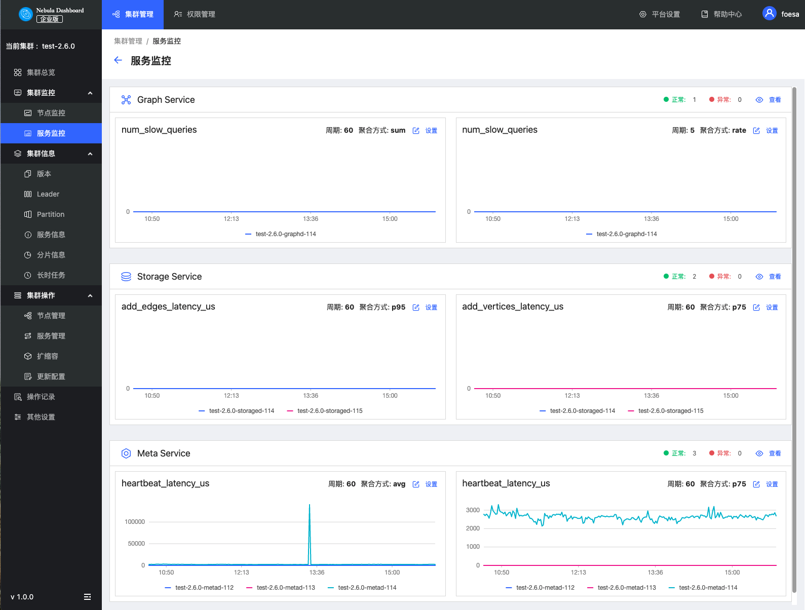

# 集群监控

本文主要介绍 Dashboard 的集群监控中的节点监控和服务监控。

## 节点监控

快速查看 CPU、Memory、Load、Disk 和 Network In/Out 变化情况。

- 如果需要设置基线，作为参考标准线，可以单击模块右上角的！[setup](../figs/Setup.png) 按钮。
- 如果需要查看某一项更详细的监控指标，可以单击模块右上角的！[watch](../figs/watch.png) 按钮，在示例中选择`Load`查看详情信息，如下图。
    
  - 默认最多可选择 14 天的监控数据进行查看，也可以快捷选择 1 小时、6 小时、12 小时、1 天、3 天、7 天和 14 天，支持修改查看时间。
  - 可以选择需要查看的机器和监控指标。监控指标详情请参见[监控指标说明](../7.monitor-parameter.md)。
  - 可以设置基线，作为参考标准线。

## 服务监控

快速查看 Graph、Meta、Storage 服务的信息，右上角显示正常服务和异常服务的数量。

!!! note

    当前企业版的服务监控页仅支持每种服务设置两个监控指标，可以单击模块内的设置按钮进行调整。

- 如果需要查看某一项更详细的监控指标，可以单击模块右上角的！[watch](../figs/watch.png) 按钮，在示例中选择 `Graph` 查看详情信息，如下图。
   
  - 默认最多可选择 14 天的监控数据进行查看，也可以快捷选择 1 小时、6 小时、12 小时、1 天、3 天、7 天和 14 天，支持修改查看时间。
  - 可以选择需要查看的机器和监控指标。监控指标详情请参见[监控指标说明](../7.monitor-parameter.md)。
  - 可以设置基线，作为参考标准线。
  - 可以查看当前服务的状态。