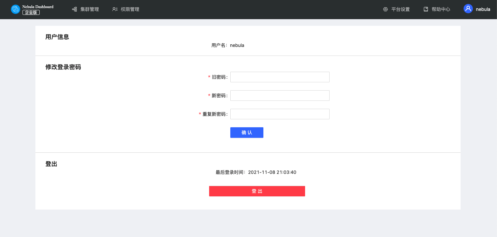

# 系统设置

本文提供了在使用 Dashboard 时可能会使用的系统设置。

## 平台设置

在标签栏中点击**平台设置**，用户可以完成以下修改：

- 修改标题、Logo 图片、封面图。
- 快速修改语言，目前仅支持中文和英文。
- 开关帮助提示。

## 帮助信息

点击帮助信息，可快速跳转至 Dashboard 文档页面、Nebula Graph 文档、官网或论坛等页面。

## 用户信息

点击右上角 **个人信息** 可修改密码或登出账号。

