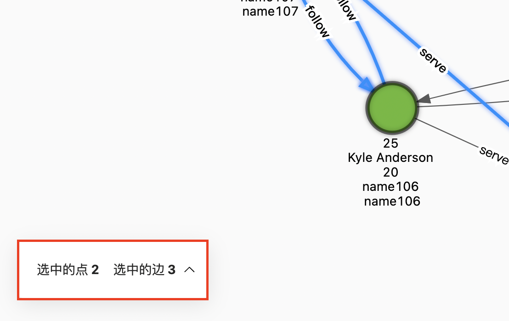

# 画布操作

本文主要介绍画布中的操作。

## 查看点边

移动鼠标到点或边上，详细查看点和边的数据，同一点上的多个 Tag 通过`|`分开。以下展示 VID 为 `107` 的点的详细信息：

## 批量选中

Explorer 支持批量选中多个点边，并查看选中点边的数据，详细数据可以在画布左下角的点边概览打开并查看。同时也支持导出选中点或边的 CSV 文件。

### 框选操作

点击！[frameselect](../figs/nav-frameSelect.png) 图标后，按住左键拖拽并框选多个点和边。示例如下：

### 点击选择多个节边

点击！[singleselect](../figs/nav-singleSelect.png) 图标或按住 Shift 后，用鼠标单击并选中多个点和边，单击空白处取消选择。示例如下：

## 快速操作

用户可以选择一个或多个点和边，在空白处点击右键可以进行对点进行扩展、查找两个点之间的路径、在页面中显示或隐藏其属性等操作。用户选择的点和边数据会影响到可以执行的操作，具体操作的说明参见[图探索拓展](../operation-guide/ex-ug-graph-exploration.md)。

点击 **适合选中尺寸** 可以将选中的数据，移动到画布的中心，方便用户查看。

## 节点筛选

用户可以对画布中显示的点进行过滤。在该示例中，选择 Tag 为 `player`，`age>=35` 的点，并启动过滤。

!!! note
    
    每一组筛选条件只针对带此 Tag 的数据，满足条件会被自动添加选中状态，不满足则置灰。其他 Tag 数据状态不受影响。

