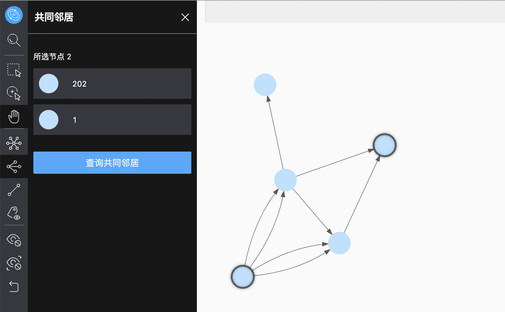

# 图探索拓展

图探索拓展分为以下四类：

- 拓展
- 共同邻居
- 路径查询
- 查看属性

## 拓展

在菜单栏，点击  图标，打开 **拓展** 窗口。用户可以双击某一点，对该点进行拓展。也可以框选画布中的多个点，在如下操作栏中修改边类型，选择边的流入流出方向，修改点的颜色，规定拓展步数和自定义过滤条件。

!!! Note

    面板内配置修改后会保存当前配置，当双击或者右键快捷拓展时候会以当前配置进行拓展。

## 共同邻居

在菜单栏，点击  图标，打开 **共同邻居** 窗口。用户可以选中画布中的两个点或多个点，查询它们的共同邻居。选中的点无共同邻居时，默认返回 **没有相应数据** 。

## 路径查询

在菜单栏，点击  图标，打开 **路径查询** 窗口。用户可以选中画布中的两个点，默认框选的第一个点为起点，第二个点为终点。用户可自定义边的类型和方向，规定拓展步数，选择查询以下三种路径： `All path`，`Shortest path` 和 `Noloop path`。

## 查看属性

在菜单栏，点击  图标，打开 **查看属性** 窗口。用户可以选择在画布中展示或隐藏点或边的属性。点击确认后，缩放比例大于 110% 时候才会显示属性在画布上，小于 110% 的时候会自动隐藏。

