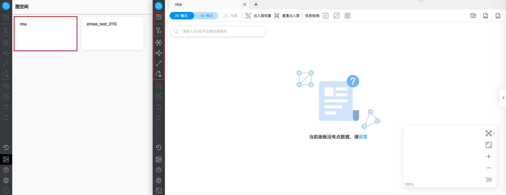

# 页面概览

本文介绍 Explorer 的基本组成，帮忙用户了解 Explorer 的各功能。

Explorer 由导航栏和画布两大模块组成。

!!! note

    登录 Explorer 后，用户需选择并单击一个目标图空间，才可进入画布页面并解锁左侧导航栏的查询及分析功能。
    

## 导航栏

用户可以通过单击 Explorer 页面左侧的图标进行图数据导入、图数据分析与探索等操作。左侧导航栏的图标及描述如下：

| 图标  | 描述 |
| ----- | ---- |
|  | 输入 VID、Tag 和子图等信息后，匹配的数据会显示到画布上。更多信息，参见[查询方式](ex-ug-query-exploration.md)。     |
|  | 对画布中显示的点进行过滤。     |
|  | 选择页面上的节点并进行自定义拓展，包括方向、步数、过滤条件等。    |
|  | 选择页面上至少两个点并查看它们的共同邻居。     |
|  | 查询起点到终点之间的 `all paths` 、 `Shortest path` 或者是 `Noloop path` 的路径。     |
|  | 选择是否显画布中的点或边的属性值。     |
|  | 隐藏画布中选中的点边。     |
|  | 隐藏画布中未选择的所有点边。     |
|  | 撤销上一步新增或隐藏的操作。     |
|  | 恢复上一步撤销的操作。     |
|  | 查看历史快照信息。更多信息，参见[画布快照](../operation-guide/canvas-snapshot.md)。     |
|  | 查看所有图空间，单击图空间新增相应图空间的画布。     |
|  | 查看更多信息。     |
|  | 查看用户名和快捷键、修改语言设置、清除 Explorer 链接等。|
|  | 通过命令行对图数据进行查询和分析。     |

## 画布

图数据可视化地展示在画布中。Explorer 的画布由以下部分组成：

- 顶部页签
- 可视化模式
- 快照
- 多布局
- 缩略图
- 数据概览

更多信息，参见[画布操作](canvas-operations/canvas-overview.md)。
