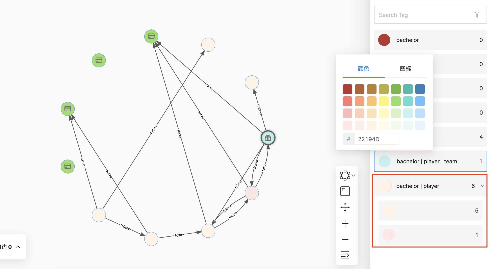

# 关系列表

用户可以在关系列表中，选中点和边。选中 Tag 为 `bachelor` 和 `player` 的 6 个点，选中 Edge 为 `serve` 的 5 条边，示例如下：

同时，用户可以修改 Tag 的颜色和图标，使得关键节点更为突出。

在默认情况下，Tag 完全相同的 VID 点的颜色相同，并且也支持手动修改一个点或一组 Tag 完全相同的点的颜色。例如标签为 `bachelor` 和 `player`的点，修改其中一个点的颜色，在关系列表中你可以点开查看，示例如下：

