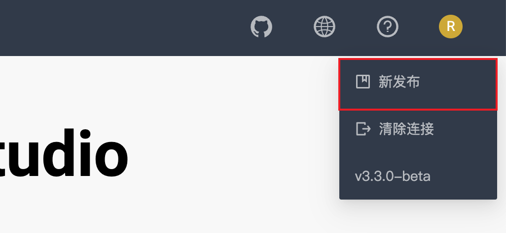

# 版本更新

Studio 处于持续开发状态中。用户可以通过 [Studio 发布版本更新](../about-studio/st-ug-release-note.md) 查看最新发布的功能。

<!-- 

## 云服务版 Studio

对于云服务版 Studio，以 Nebula Graph Cloud Service 上实际部署的版本为准，用户不能自行更新 Studio 版本。当前公测环境里的 Studio 版本为 v{{ studio.base111b }}。

-->

成功连接 Studio 后，用户可以在页面右上角点击版本号，再点击 **新发布**，前往查看 Studio 的版本更新记录。

