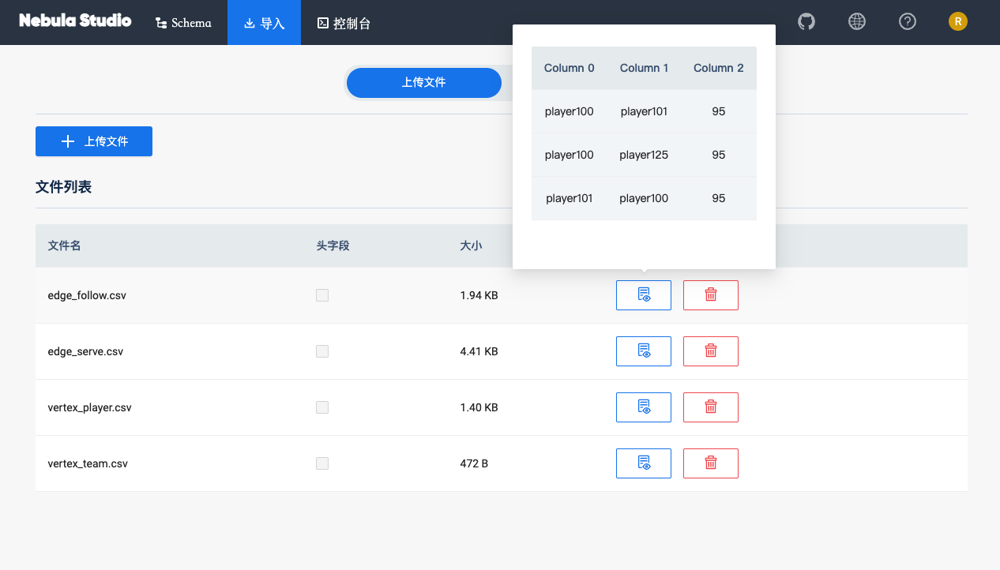
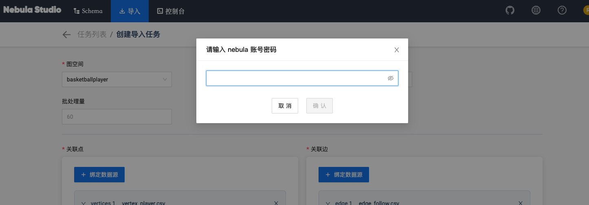
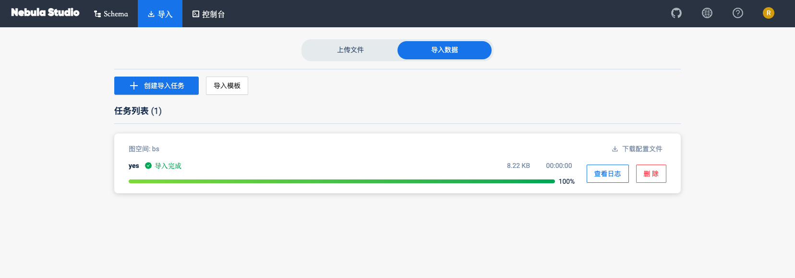

# 导入数据

准备好 CSV 文件，创建了 Schema 后，用户可以使用 **导入** 功能将所有点和边数据上传到 Studio，用于数据查询和数据分析。

## 前提条件

导入数据之前，需要确认以下信息：

- Studio 已经连接到 Nebula Graph 数据库。

- Nebula Graph 数据库里已经创建了 Schema。

- CSV 文件符合 Schema 要求。

- 账号拥有 GOD、ADMIN、DBA 或者 USER 的权限，能往图空间中写入数据。

## 操作步骤

在导入数据之前，用户需要先上传文件后再创建导入任务。
### 上传文件

按照以下步骤导入数据：

1. 在顶部导航栏里，点击 **导入** 页签。
2. 在 **上传文件** 页面，点击 **上传文件** 按钮，并选择需要的 CSV 文件。本示例中，选择 `edge_serve.csv`、`edge_follow.csv`、`vertex_player.csv` 和 `vertex_team.csv` 文件。

  !!! Note

        一次可以选择多个 CSV 文件，本文使用的 CSV 文件可以在[规划 Schema ](st-ug-plan-schema.md) 中下载。

3. 上传结束后，可以在文件列表的 **操作** 列，点击  图标预览文件内容，或点击  图标删除上传的文件。

### 导入数据

按照以下步骤导入数据：

1. 在顶部导航栏里，点击 **导入** 页签。
2. 在标签页内点击 **导入数据** 按钮。
3. 在 **导入数据** 页面，点击 **导入模版** 直接通过配置文件导入数据或点击 **+ 创建导入任务** 按钮，完成以下任务：
  - 选择图空间。
  - 填写任务名称。
  - （可选）填写批处理量。
  - 在 **关联点** 页签里，点击 **+ 绑定数据源** 按钮，在对话框中选择绑定文件，并点击 **确认** 按钮。如本示例中的 `vertex_player.csv`文件。

    - 在 **vertices 1** 页签下的 `verteID` 项中，点击 **Select CSV Index**，在弹出的对话框内选择vertexID所在的列。
    - 点击 **+ Tag** 按钮，点击右方的图标，在显示的属性列表中，为 Tag 属性绑定源数据。在本示例中，`player` 标签的 `name` 属性对应文件中的 **Column 2** 列，类型为 `string`，`age` 属性对应文件中的 **Column 1** 列，类型 为 `int`。
  
  - 在 **关联边** 页签里，点击 **+ 绑定数据源** 按钮，在对话框中选择绑定文件，并点击 **确认** 按钮。如本示例中的 `edge_follow.csv`文件。
    - 在 **edge 1** 页签下，点击右方的图标，在显示的属性列表中，选择 Edge Type。
    - 根据 Edge type 的属性，从 `edge_follow.csv` 文件中选择相应的数据列。其中，**srcId** 和 **dstId** 分别表示边的起点与终点，所选择的数据及处理方式必须与相应的 VID 保持一致。本示例中，**srcId** 对应的是表示起点球员的 VID，**dstId** 对应的是表示终点球员的 VID。rank 为选填项，可以忽略。
    

4. 完成设置后，点击 **导入** 按钮。

5. 用户输入 Nebula 账号的密码后方可导入数据。
  

6. 导入数据后可以在 **导入数据** 页签内查看日志、下载日志、下载配置文件、删除任务等操作。
  

## 后续操作

完成数据导入后，用户可以进入[控制台](st-ug-console.md)页面。
