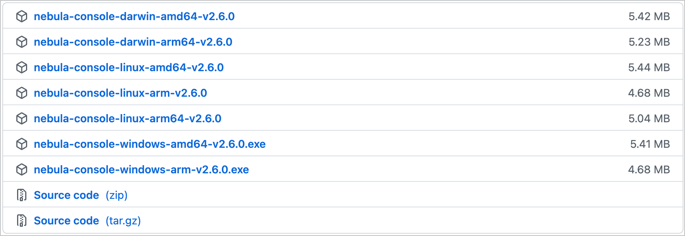

Nebula Graph 支持多种类型客户端，包括 CLI 客户端、GUI 客户端和流行编程语言开发的客户端。本文将概述 Nebula Graph 客户端，并介绍如何使用原生 CLI 客户端 Nebula Console。

## Nebula Graph 客户端

用户可以使用已支持的[客户端或者命令行工具](https://docs.nebula-graph.com.cn/{{nebula.release}}/20.appendix/6.eco-tool-version/)来连接 Nebula Graph 数据库。<!--这里用外链。-->

<!-- TODO 云服务未能和 v{{ nebula.release }} 一起发布。
如果还没有 Nebula Graph 数据库，建议尝试云服务 [Nebula Graph Cloud Service](https://cloud.nebula-graph.com.cn/)。Nebula Graph Cloud Service 支持按需部署和快速搭建，并且使用 Nebula Graph Studio 作为默认客户端。
-->

## 使用 Nebula Console 连接 Nebula Graph

### 前提条件

- Nebula Graph 服务已[启动](https://docs.nebula-graph.com.cn/{{nebula.release}}/4.deployment-and-installation/manage-service/)。<!--这里用外链。-->

- 运行 Nebula Console 的机器和运行 Nebula Graph 的服务器网络互通。

### 操作步骤

1. 在 [Nebula Console](https://github.com/vesoft-inc/nebula-console/releases "the nebula-console Releases page") 下载页面，确认需要的版本，单击** Assets**。

  !!! Note

        建议选择**最新**版本。

    

2. 在** Assets **区域找到机器运行所需的二进制文件，下载文件到机器上。

    

3. （可选）为方便使用，重命名文件为`nebula-console`。

  !!! Note

        在 Windows 系统中，请重命名为`nebula-console.exe`。

4. 在运行 Nebula Console 的机器上执行如下命令，为用户授予 nebula-console 文件的执行权限。

  !!! Note

       Windows 系统请跳过此步骤。

    ```bash
    $ chmod 111 nebula-console
    ```

5. 在命令行界面中，切换工作目录至 nebula-console 文件所在目录。

6. 执行如下命令连接 Nebula Graph。

  - Linux 或 macOS

    ```bash
    $ ./nebula-console -addr <ip> -port <port> -u <username> -p <password>
      [-t 120] [-e "nGQL_statement" | -f filename.nGQL]
    ```

  - Windows

    ```powershell
    > nebula-console.exe -addr <ip> -port <port> -u <username> -p <password>
      [-t 120] [-e "nGQL_statement" | -f filename.nGQL]
    ```

  参数说明如下。

    | 参数 | 说明 |
    | - | - |
    | `-h` | 显示帮助菜单。 |
    | `-addr` | 设置要连接的 graphd 服务的 IP 地址。默认地址为 127.0.0.1。|
    | `-port` | 设置要连接的 graphd 服务的端口。默认端口为 9669。|
    | `-u/-user` | 设置 Nebula Graph 账号的用户名。未启用身份认证时，可以使用任意已存在的用户名（默认为`root`）。 |
    | `-p/-password` | 设置用户名对应的密码。未启用身份认证时，密码可以填写任意字符。 |
    | `-t/-timeout`  | 设置整数类型的连接超时时间。单位为秒，默认值为 120。 |
    | `-e/-eval` | 设置字符串类型的 nGQL 语句。连接成功后会执行一次该语句并返回结果，然后自动断开连接。 |
    | `-f/-file` | 设置存储 nGQL 语句的文件的路径。连接成功后会执行该文件内的 nGQL 语句并返回结果，执行完毕后自动断开连接。 |

用户可以使用`./nebula-console --help`命令获取所有参数的说明，也可以在[项目仓库](https://github.com/vesoft-inc/nebula-console/tree/{{console.branch}})找到更多说明。
